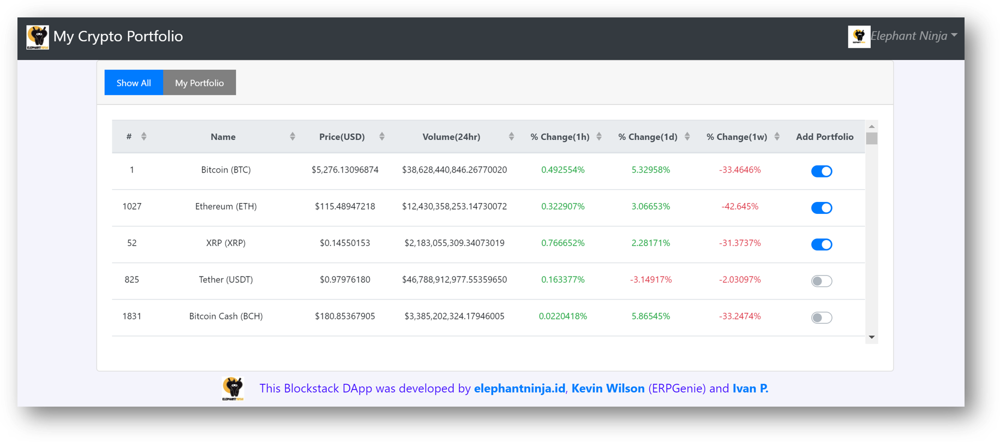
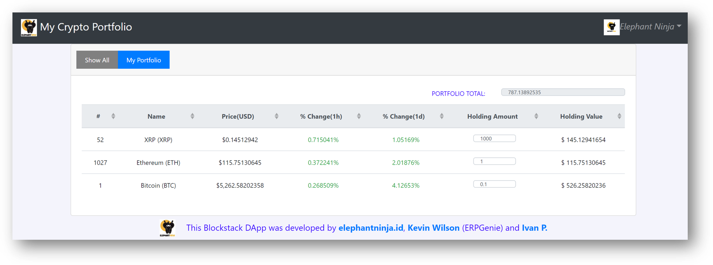

# Blockstack POC- Crypto Portfolio
Simple Crypto Portfolio leveraging Blockstack

Build and deploy a distributed app that has the user authenticate with their Blockstack ID. Once logged in they will be able to pull real data around Crypto currency prices and see which are the fastest moving ones. The user will be allowed to select and store a quantity of crypto as part of their portfolio which is stored in their own Gaia storage hub that was made available to them during the Blockstack signup process.

 

Technology : Blockstack , Gaia Hub

Skills : Node.js, express, vue.js

